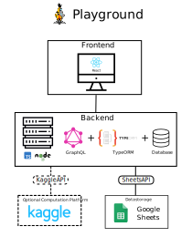

# AdapterHub Playground

Using the newest Natural Language Processing tools made easy with the AdapterHub Playground.  

**Predict, Train and Cluster** your data without any coding knowledge based on the latest models provided by [AdapterHub](https://adapterhub.ml/).

Visit **https://adapter-hub.github.io/playground** to get started with the AH Playground.

## Architecture

* **Frontend** - Interface to the User: provides a visual interface for creating/editing/deleting of projects and creating/deleting their tasks
* **Backend** - Provides the BackendAPI for the frontend to maintain projects and tasks. The projects and tasks are stored in the SQL Database. The backend also generates the code based on the provided task configuration from the frontend. The code execution is either done using the KaggleAPI on Kaggle or locally on the machine.
* **Google Sheets** - Provides the data in form of a table: input for prediction and gold labels for training.
* **Kaggle (optional)** - Provides the KaggleAPI and enables remote python code execution on foreign computation resources provided by Kaggle.