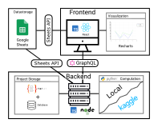

# AdapterHub Playground

Using the newest Natural Language Processing tools made easy with the AdapterHub Playground.

**Predict, Train and Cluster** your data without any coding knowledge based on the latest models provided by [AdapterHub](https://adapterhub.ml/).

Visit our live demo at **https://adapter-hub.github.io/playground** to get started with the AH Playground.


## Architecture



-   **Frontend** - Interface to the User: provides a visual interface for creating/editing/deleting of projects and creating/deleting their actions
-   **Backend** - Provides the BackendAPI for the frontend to maintain projects and actions. The projects and actions are stored in the SQL Database. The backend also generates the code based on the provided action configuration from the frontend. The code execution is either done using the KaggleAPI on Kaggle or locally on the machine.
-   **Google Sheets** - Provides the data in form of a table: input for prediction and gold labels for training.
-   **Kaggle (optional)** - Provides the KaggleAPI and enables remote python code execution on foreign computation resources provided by Kaggle.

## Frontend

The "master" branch contains the frontend. Use `npm install` and `npm run start` develop/host it locally.

## Backend

The "backend" branch of this repository contains the backend code.  
It is build using NodeJS and requires python and some additional packages to execute code locally.  
We provide a dockerfile that runs the backend without any additional setup (including the database).  
To run this docker instance execute the following commands:

```
docker build https://raw.githubusercontent.com/Adapter-Hub/playground/backend/Dockerfile -t ah_playground
docker run -d -p 4000:4000 ah_playground
```

Contact person: [Tilman Beck](mailto:beck@ukp.informatik.tu-darmstadt.de)

https://www.ukp.tu-darmstadt.de/


Don't hesitate to send us an e-mail or report an issue, if something is broken (and it shouldn't be) or if you have further questions.

> This repository contains experimental software and is published for the sole purpose of giving additional background details on the respective publication.

## Citation

Our paper: [AdapterHub Playground: Simple and Flexible Few-Shot Learning with Adapters](https://aclanthology.org/2022.acl-demo.6/)

```
@inproceedings{beck-etal-2022-adapterhub,
    title = "{A}dapter{H}ub Playground: Simple and Flexible Few-Shot Learning with Adapters",
    author = "Beck, Tilman  and
      Bohlender, Bela  and
      Viehmann, Christina  and
      Hane, Vincent  and
      Adamson, Yanik  and
      Khuri, Jaber  and
      Brossmann, Jonas  and
      Pfeiffer, Jonas  and
      Gurevych, Iryna",
    booktitle = "Proceedings of the 60th Annual Meeting of the Association for Computational Linguistics: System Demonstrations",
    month = may,
    year = "2022",
    address = "Dublin, Ireland",
    publisher = "Association for Computational Linguistics",
    url = "https://aclanthology.org/2022.acl-demo.6",
    doi = "10.18653/v1/2022.acl-demo.6",
    pages = "61--75",
    abstract = "The open-access dissemination of pretrained language models through online repositories has led to a democratization of state-of-the-art natural language processing (NLP) research.This also allows people outside of NLP to use such models and adapt them to specific use-cases.However, a certain amount of technical proficiency is still required which is an entry barrier for users who want to apply these models to a certain task but lack the necessary knowledge or resources.In this work, we aim to overcome this gap by providing a tool which allows researchers to leverage pretrained models without writing a single line of code.Built upon the parameter-efficient adapter modules for transfer learning, our AdapterHub Playground provides an intuitive interface, allowing the usage of adapters for prediction, training and analysis of textual data for a variety of NLP tasks.We present the tool{'}s architecture and demonstrate its advantages with prototypical use-cases, where we show that predictive performance can easily be increased in a few-shot learning scenario.Finally, we evaluate its usability in a user study.We provide the code and a live interface at https://adapter-hub.github.io/playground.",
}
```
